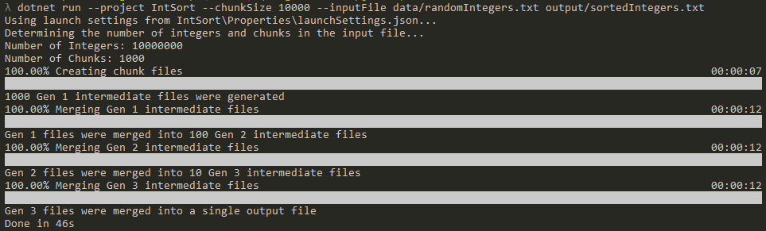
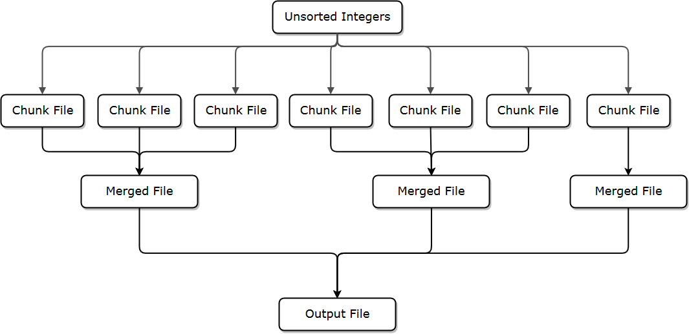

# Sorting a Large Number of Integers

This is the the same problem from the [NodeLargeSort](https://github.com/Maultasche/NodeLargeSort) project, but solved using C#

It is essentially a version of merge sort that uses files and has variable-length merge chunks, where chunks can be 
merged together in any number instead of two at a time like the typical merge sort.

## Overview

This project is a fun exercise in sorting a very large number of integers while keeping only a subset of integers in memory at any particular time. The number of integers to load and keep in memory at any given time is known as "chunk", and all the integers will be sorted and placed in an output file without ever storing more than one chunk of integers in memory.

How do we sort a bunch of integers without loading them all into memory at any given time? The answer is files: we produce a lot of sorted intermediate files and them merge them together one integer at at time to produce the final sorted output file.

I originally saw this listed somewhere as an interview question, and while I figured out the answer fairly quickly ("Store the integers in files, sort them in chunks, and then merge the sorted chunks"), I found myself pondering the implementation details. In other words, how would I implement that solution?. After thinking about the implementation details and coming up with a strategy, I decided to go ahead and implement it and see if the solution in my head would actually work.

The solution did work.

This project consists of two runnable programs.

1. A program for generating large numbers of random integers
  - Accepts the number of integers to generate as an input parameter
  - Writes the randomly generated integers to an output file, the name of which is an input parameter
  - The output file contains one integer per line
2. A program for sorting the integers
  - Accepts the input file and the maximum number of integers to load into memory at any time during the process (aka the chunk size)
  - Writes the final result to an output file, the name of which is also an input parameter
  - Accepts a parameter which will tell the sorting program to not erase the intermediate files when it is done
  - The input file is assumed to have one integer per line and will produce an output file with one integer per line

## Current Status

This project is now finished and working as expected. The integer generator tool generates a text file containing random integers and the sorting tool sorts the integers in a text file without loading more than a specified number of integers into memory at any particular time.

I've successfully generated and sorted a billion integers in the range [-100,000 to 100,000] in chunks of 100,000. The input and output files were 6.3 GB in size, and on my machine, it took 4 minutes, 25 seconds to generate a billion integers and 1 hour, 40 minutes to sort a billion integers while having no more than 100,000 integers in memory at a time. This was significantly faster than my [Node.js solution](https://github.com/Maultasche/NodeLargeSort), which took 19 hours to sort a billion integers.

The memory usage was satisfactory at 16-18 MB, most of which was probably used by the .NET Core libraries and runtime. It is certainly more memory efficient than the Node.js solution.

## Running the Integer Generator and Sorting Tools

To run the integer generation and sorting tools, you'll need to have (.NET Core runtime)[https://www.microsoft.com/net/download] installed. .NET Core 2 was used for the development of this project, but later versions of .NET Core will likely be able to run this project as well.

To generate integers, use the integer generation tool to generate random integers, run ```dotnet run --project IntGen``` from the root directory. The following example will generate 10,000 integers between -1,000 and 1,000 and write the results into data/randomNumbers.txt.

```
dotnet run --project IntGen --count 10000 --lowerBound -1000 --upperBound 1000 data\randomIntegers.txt
```

To sort a text file containing an integer on each line, run ```dotnet run --project IntSort```. The following example will read the integers in data/randomNumbers.txt in chunks of 100, meaning that no more than 100 integers will be in memory at any given time. The integers will be sorted using intermediate files and then merged into a single file without keeping more than 100 integers in memory at a time. The sorted integers will be written to output/sortedIntegers.txt.

The ```--keepIntermediate``` flag will leave the intermediate files in place so that they can be examined. If you remove the ```--keepIntermediate``` flag, all the intermediate files will be cleaned up after the program completes, and just the final output file will remain.

```
dotnet run --project IntSort --chunkSize 100 --inputFile data/randomIntegers.txt --keepIntermediate output/sortedIntegers.txt
```

This is an example of what the output looks like when sorting integers.


 
## Sorting Strategy

If only N integers can be loaded into memory at any given time, but the total number of integers (T) is such that T > N, we'll have to follow a strategy of sorting chunks of integers and then merging those chunks.

1. Analyze the input file to determine how many lines there are, which will tell us how many integers there are (T)
2. Divide T by N (rounding up) to determine how many chunks of integers we'll be using
3. Read through the input file, reading chunks of N integers into memory
4. Sort each chunk of integers in memory and write each chunk to an intermediate file, which will result in F intermediate files, where F * N <= T. The last chunk will likely be smaller than N unless T % N === 0. This first batch of files will be referred to as Gen 1 files.
5. We'll open up to P files at a time, where P will probably be 10. Each file contains a chunk of sorted integers, so we'll have P pointers to the integers at the beginning of the file.
6. We'll find the min value in that set of P integers, and write that to an intermediate output file. Then we'll take the file pointer where the min value originated from and advance that file pointer to the next integer. We'll repeat this until all P file pointers have advanced to the end of the file.
7. Repeat Steps 5 and 6 until all F output files have been processed. The resulting sorted files will be referred to as Gen 2 files. 
8. At this point, we may only have one Gen 2 file, in which case we are be finished, but if F > P, we'll have multiple Gen 2 files where the size of each file is P * N integers. In that case, repeat Steps 5 - 7 until all we only produce a single output file (the Gen R file, where R is the number of intermediate file iterations we went through). 

Each intermediate file iteration will reduce the number of intermediate files by a factor of P, so the performance of the merging process will be O(N Log(N))

The following diagram is a visualization of the sorting strategy.



## Testing Stategy

- Test sorting an empty file
- Test sorting a file with a single number
- Test sorting 20 numbers, where we can easily verify all the numbers
- Test sorting an input file where T < N, and verify that the correct intermediate files were produced
- Test sorting an input file where T === N, and verify that the correct intermediate files were produced
- Test sorting an input file where T > N, and verify that the correct intermediate files were produced
- Test sorting an input file where T > P * N, and verify that the correct intermediate files were produced 
- Test sorting an input file where T == (P * N) + 1, and verify that P + 1 intermediate sorted chunk files were produced, with the first P files having N sorted integers in them, and the P + 1 file having one integer in it. The first round of merging should produce two intermediate, the first file with P * N sorted integers in it and the second file having a single integer in it. After the second round of merging, the integer in the second file should be merged with the other integers in the final output file.
- Test sorting a very large number of integers. A billion integers would suffice.
- Test sorting using small (1,000), moderate (10,000), and large numbers for N (1,000,000)

## Running Tests

On a Windows command line
```
runTests.bat
```

In a bash shell:
```
./runTests.sh
```

You can also run the tests using the Test Explorer or Test menu in Visual Studio.

##Understanding the Code

If you're interested in understanding the structure of the code, there's documentation describing how the code is structured.

- [IntGen](doc/IntGenImplementationDetails.md)
- [IntSort](doc/IntSortImplementationDetails.md)
